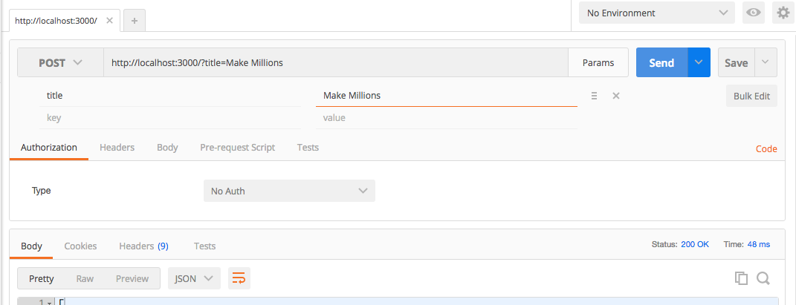
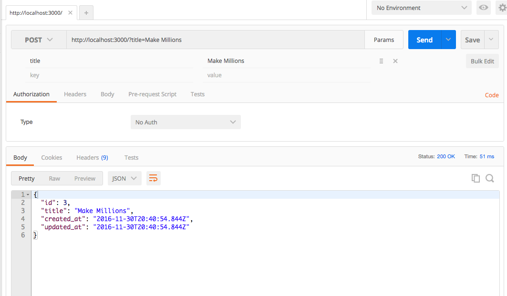

# Simple API

Let's create a simple single resource API for Todos. We will use the [ActionController::Base#render](http://guides.rubyonrails.org/layouts_and_rendering.html#using-render) method's :json option to convert the ActiveRecord objects to JSON and render that JSON back to the browser.

1. Create a Rails App (with PostgreSQL set as Database)

    ```bash
    $ rails new simple-api -d postgresql
    ```
2. cd into application folder

    ```bash
    $ cd simple-api
    ```
3. We can use a model generator to create the Todo model with a title attribute. The model generator will also create a migration file to create the todos table.

    ```bash
    $ rails g model Todo title:string
    ```
4. Use the "db:create" rake command to create the development and test Databases (make sure you have Postgres running)

    ```bash
    $ rake db:create
    ```
5. Use the "db:migrate" rake command to run the migration (created by the model generator) which creates the todos table

    ```bash
    $ rake db:migrate
    ```
6. We can use a generator to create the Todos controller

    ```bash
    $ rails g controller todos
    ```
7. Let's add some actions to our controller. We are using the [ActionController::Base#render](http://guides.rubyonrails.org/layouts_and_rendering.html#using-render) method's :json option to convert the ActiveRecord objects to JSON and render that JSON back to the browser.

    ```ruby
    class TodosController < ApplicationController
      def index
        render json: Todo.all
      end

      def create
        render json: Todo.create(todo_params)
      end

      def destroy_all
        Todo.delete_all
        render plain: ""
      end

      def show
        render json: Todo.find(params[:id])
      end

      def update
        render json: Todo.update(params[:id], todo_params)
      end

      def destroy
        Todo.delete(params[:id])
        render plain: ""
      end

      private

      def todo_params
        params.permit(:title)
      end
    end
    ```
8. Add routing to routes.rb

    ```ruby
    Rails.application.routes.draw do
      post "/" => "todos#create"
      delete "/" => "todos#destroy_all"
      get "/:id" => "todos#show"
      patch "/:id" => "todos#update"
      delete "/:id" => "todos#destroy"

      root 'todos#index'
    end
    ```
9. Add some dummy data through rails c (or use seeds.rb)

    ```bash
    $ rails c
    irb(main):001:0> Todo.create(title: "Learn Rails")
    irb(main):001:0> Todo.create(title: "Make Todo App")
    ```
10. Fire up the server

    ```bash
    $ rails s
    ```

### Let's check out our ***CRUD***

#### ***READ*** root 'todos#index'

* Go to http://localhost:3000/ in your browser.
* This is an HTTP get request to '/', which points to the index action in the TodosController:

    ```ruby
    def index
      render json: Todo.all
    end
    ```
* This index action queries the todos table for all of the Todos, rendering them as JSON

#### ***READ*** get "/:id" => "todos#show"

* Go to http://localhost:3000/1 in your browser.
* This is an HTTP get request to '/1', which points to the show action in the TodosController (with params[:id] = 1):

    ```ruby
    def show
      render json: Todo.find(params[:id])
    end
    ```
* This show action finds the todo with primary key 1, rendering the response as JSON

#### ***CREATE*** post "/" => "todos#create"

* We are restricted to GET requests via the browser's URL window. We can use cURL or Postman to make more complicated HTTP requests. Let's try and make a POST request
  * Using Postman: POST http://localhost:3000/?title=Make Millions

      
  * ***or*** cURL

      ```bash
      $ curl -X POST -H 'Content-Type: application/json' -d '{"title":"Make Millions"}' http://localhost:3000
      ```
* We get a 422: Unprocessable Entity. This is because Rails has a default configuration to reject POST requests without authenticity tokens. A protective measurement to prevent malicious CSRF attacks. Since we are building a stateless API, let's turn off the protection by removing the [protect_from_forgery](http://api.rubyonrails.org/classes/ActionController/RequestForgeryProtection.html) method in the ApplicationController.

    ```ruby
    class ApplicationController < ActionController::Base
    end
    ```
* Now we are able to create Todos

  

#### ***UPDATE*** patch "/:id" => "todos#update"

* Let's update our last todo by sending a patch request to our last todo. The todo with a primary key (id) of 3.

    ```bash
    $ curl -X PATCH -H 'Content-Type: application/json' -d '{"title":"Make myself proud"}' http://localhost:3000/3
    ```

#### ***DELETE*** delete "/:id" => "todos#destroy"

* Let's destroy the newly updated todo by sending a delete request to '/3'.

    ```bash
    $ curl -X DELETE  http://localhost:3000/3
    ```

#### ***DELETE*** delete "/" => "todos#destroy_all"

* Let's destroy all of our todos by sending a delete request to '/'.

    ```bash
    $ curl -X DELETE  http://localhost:3000/
    ```
